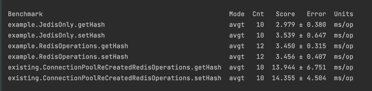

# jedis-redis-perf-test

Setup

#Start Redis Server Instance
docker run -p 6379:6379 -m "4g" redislabs/redismod

#Run test suite
Clone the repository
mvn clean install
Run the "BenchmarkRunner.java"

#Benchmark results

