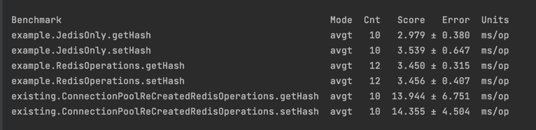
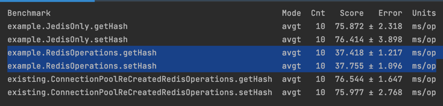
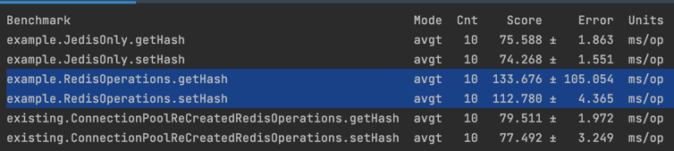

# jedis-redis-perf-test

Setup

#Start Redis Server Instance
    docker run -p 6379:6379 -m "4g" redislabs/redismod

#Run test suite
    Clone the repository
    mvn clean install
    Run the "BenchmarkRunner.java"

#Benchmark results

    Below benchmark results were captured when application connected connected to single redis server instance deployed on docker.

    Below benchmark results were captured when application connected to Redis database deployed on GCP RE cluster.Default Pool Configurations

    Custom pool configurations
`poolConfig.setTestOnBorrow(true);
poolConfig.setTestOnReturn(true);
poolConfig.setTestWhileIdle(true);`

